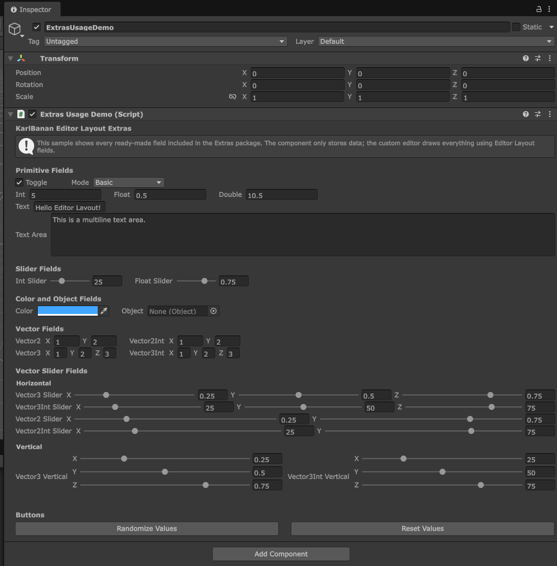

# Editor Layout Extras

Editor Layout Extras is an optional Unity editor package that adds ready to use inspector fields for [KarlBanan Editor Layout](https://github.com/ClearKitten/com.karlbanan.editorlayout).

The core package provides the layout system and base APIs. This extras package provides common fields implementations such as buttons, text fields, sliders, object fields, color fields, vector fields, and more.



## Features

- `InspectorButton`
- `ToggleField`
- `TextField`
- `TextArea Field`
- `IntField`
- `FloatField`
- `DoubleField`
- `EnumField<TEnum>`
- `ObjectField`
- `ColorField` 
- `IntSliderField` 
- `FloatSliderField`
- `Vector2Field`
- `Vector2IntField`
- `Vector3Field`
- `Vector3IntField`
- `Vector2SliderField`
- `Vector2IntSliderField`
- `Vector3SliderField`
- `Vector3IntSliderField`
- Horizontal and vertical slider layouts

## Installation

### Install from Git URL

In Unity:

1. Open **Window > Package Manager**
2. Press **+**
3. Select **Install package from git URL**
4. Enter:

```txt
https://github.com/ClearKitten/com.karlbanan.editorlayout.extras.git
```

To install a specific version tag:

```txt
https://github.com/ClearKitten/com.karlbanan.editorlayout.extras.git#v1.0.0
```

## Dependency

This pacakges depends on the core package:

```txt
com.karlbanan.editorlayout
```

## Requirements

- Unity 6000.0 or newer
- Editor Layout `1.0.0` or newer

## Basic Usage

Use the extras fields inside editor only code, such as a custom inspector or editor window.

```csharp
using UnityEditor;
using UnityEngine;
using KarlBanan.EditorLayout;

[CustomEditor(typeof(MyComponent))]
public sealed class MyComponentEditor : Editor
{
    private MyComponent component;

    private void OnEnable()
    {
        component = (MyComponent)target;
    }

    public override void OnInspectorGUI()
    {
        EditorDraw.FixedRow(
            LayoutSettings.StretchLastSettings,

            new ToggleField(
                "Enabled",
                component.enabledValue,
                value => SetValue("Change Enabled", () => component.enabledValue = value)),

            new FloatSliderField(
                "Power",
                component.power,
                0f,
                1f,
                value => SetValue("Change Power", () => component.power = value))
        );

        EditorDraw.FixedRow(
            LayoutSettings.StretchLastSettings,

            new ColorField(
                "Color",
                component.color,
                value => SetValue("Change Color", () => component.color = value)),

            new ObjectField(
                "Target",
                component.target,
                allowSceneObjects: true,
                value => SetValue("Change Target", () => component.target = value),
                type: typeof(GameObject))
        );
    }

    private void SetValue(string undoName, System.Action applyValue)
    {
        Undo.RecordObject(component, undoName);
        applyValue?.Invoke();
        EditorUtility.SetDirty(component);
    }
}
```

Example component:

```csharp
using UnityEngine;

public sealed class MyComponent : MonoBehaviour
{
    public bool enabledValue = true;
    public float power = 0.5f;
    public Color color = Color.white;
    public GameObject target;
}
```

## Vector Sliders

Vector slider fields can be drawn horizontally or vertically.

```csharp
new Vector3SliderField(
    "Offset",
    component.offset,
    0f,
    1f,
    value => SetValue("Change Offset", () => component.offset = value),
    sliderLayout: VectorSliderLayout.Vertical)
```

## Samples

This package includes an **Extras Usage Example** sample.

The sample contains:

- A Unity scene
- A MonoBehaviour demo component
- A Custom editor showing all extras fields in one inspector

To Import it:

1. Open **Window > Package Manager**
2. Select **Editor Layout Extras**
3. Open **Samples**
4. Import **Extras Usage Example** 
5. Open the included sampled scene

The README only shows a small usage example. Import the sample for the full showcase.

## License 

MIT License. See [LICENSE.md](LICENSE.md).
